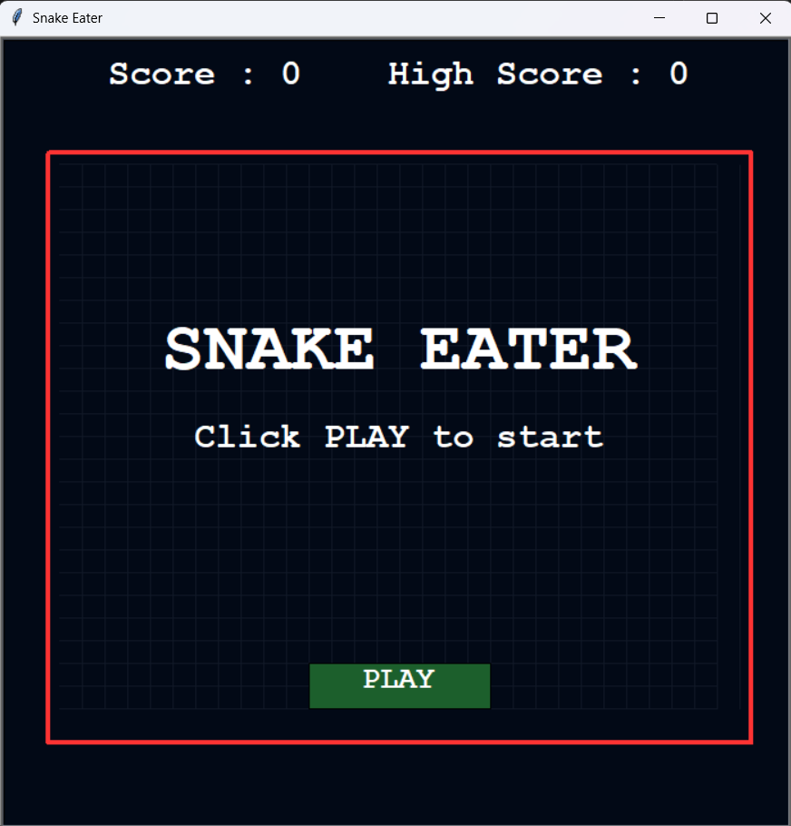
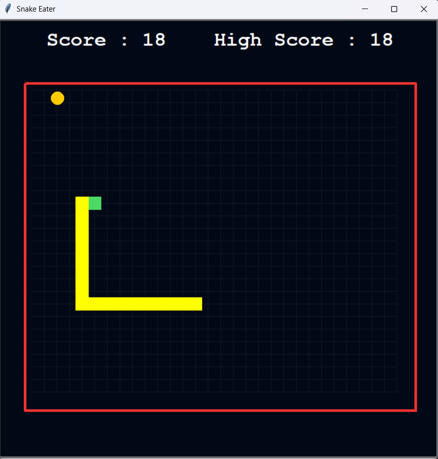
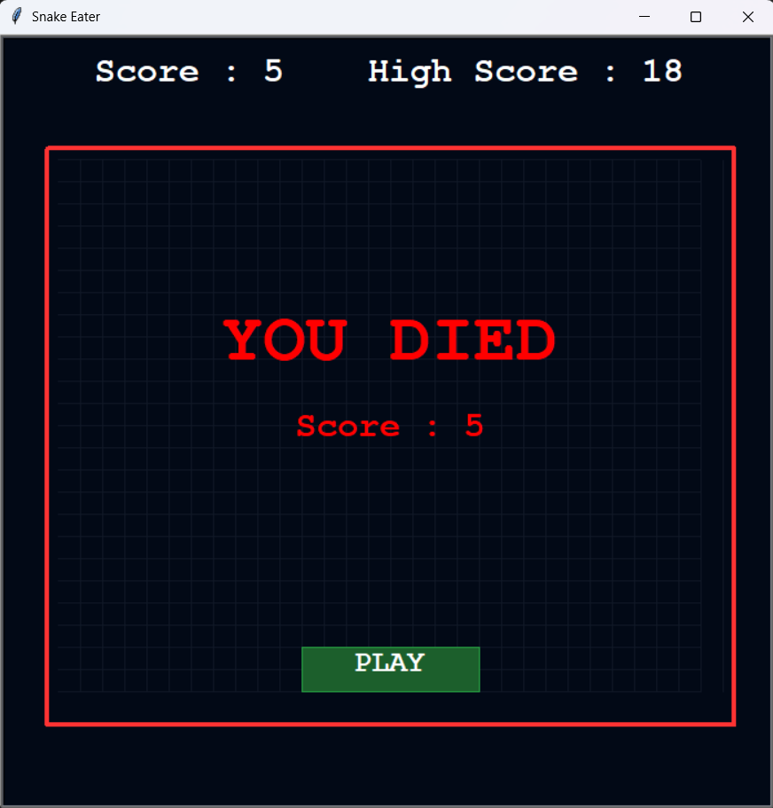

## Snake Eater

This is my simple Snake game built with Python's `turtle` module.

## 🎮 How I Designed the Game

- I use the arrow keys to control the snake (up, down, left, right).
- When the snake eats the yellow food, it grows and the score increases.
- The speed slowly increases as the score goes up.
- If the snake hits the red border or its own body, the game ends.
- After I die, I can click the **PLAY** button to start a new run.

## 🧠 Main Features

- Start screen with the title and a clear **PLAY** button.
- Live score and high-score display at the top.
- Simple grid background and border to define the play area.
- Built only with the `turtle` module, no extra libraries needed.

## 📸 Screenshots

### 1. Start Screen



### 2. Gameplay



### 3. Game Over Screen



## 🚀 How to Run

```bash

# Run the game
python main.py
```

## 👨‍💻 Author

[Jaikrishna](https://github.com/jaikrishna-j)